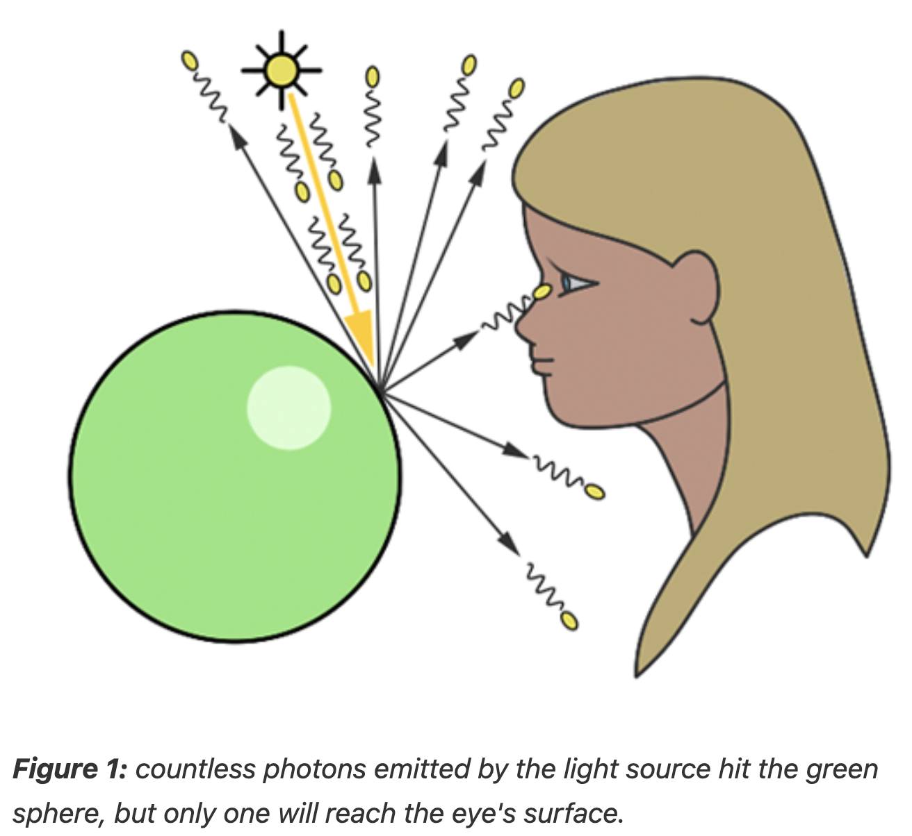
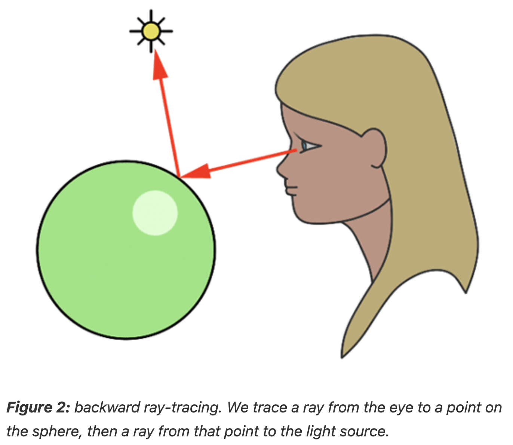

# From last chapter

- al-Haytham's work lets us know:
  1. without light, visibility is null
  2. without objects to interact, light itself is invisible to us

# Forward tracing (light tracing)

- Of the myriad rays reflected off an object, only a minuscule fraction will actually be perceived by the human eye

- In the realm of computer graphics, we substitute our eyes with an image plane made up of pixels

- Photons emitted by a light source impact the pixels on this plane, incrementally brightening them

- This process continues until all pixels have been appropriately adjusted, culminating in the creation of a computer-generated image

  - This method is referred to as **forward ray tracing**, tracing the path of photons from their source to the observer

- But it raises an **significant issue**:
  - In our scenario, we assumed that every reflected photon would intersect with the eye's surface
  - But there are infinite number of ray paths from the object
  - To simulate and calculate all of them would be impractical

## Eye surface

- Indeed, the eye functions more like a surface receptor, akin to the film or CCD in cameras, rather than a mere point receptor
  - In short, eye should be simulated as a surface rather than just a point

## Conclusion

- Forward ray tracing or light tracing, which involves casting rays from the light source, can theoretically replicate natural light behavior on a computer

- However, as discussed, this technique is neither efficient nor practical for actual use

# Backward tracing (eye tracing)

- Rays are traced in the opposite direction, from the viewer to the objects in the scene

- The inaugural ray shot from the eye (or camera) into the scene is referred to in computer graphics literature as a **primary ray**, **visibility ray**, or **camera ray**

- Upon impacting an object, we evaluate the light it receives by dispatching another ray - termed a light or shadow ray - from the contact point towards the light source
  - If this "light ray" encounters obstruction by another object, it indicates that the initial point of contact is shadowed, receiving no light
  - Hence, these rays are more aptly called shadow rays
