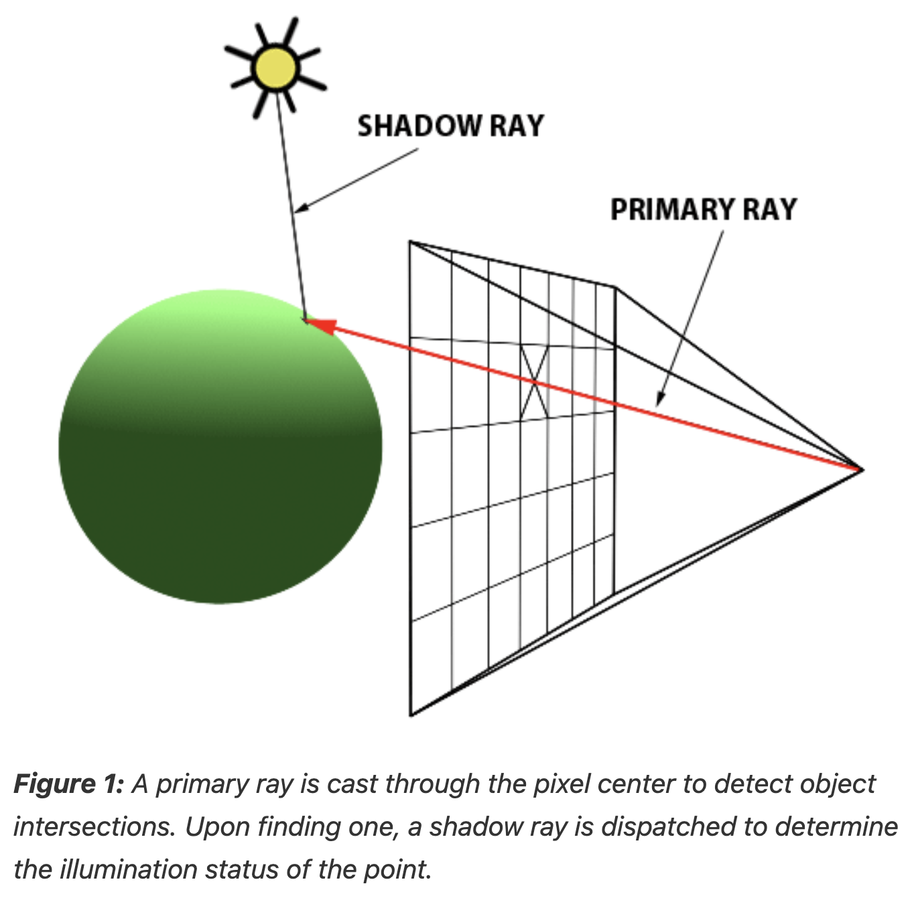
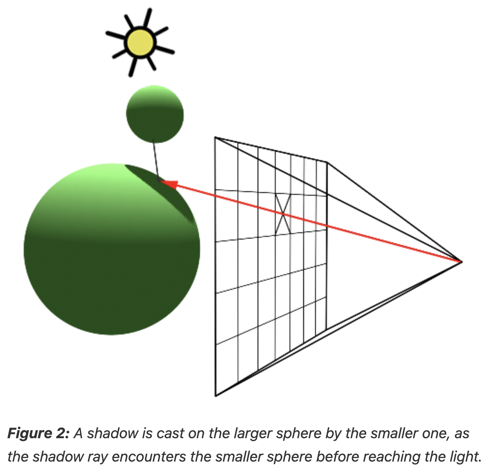
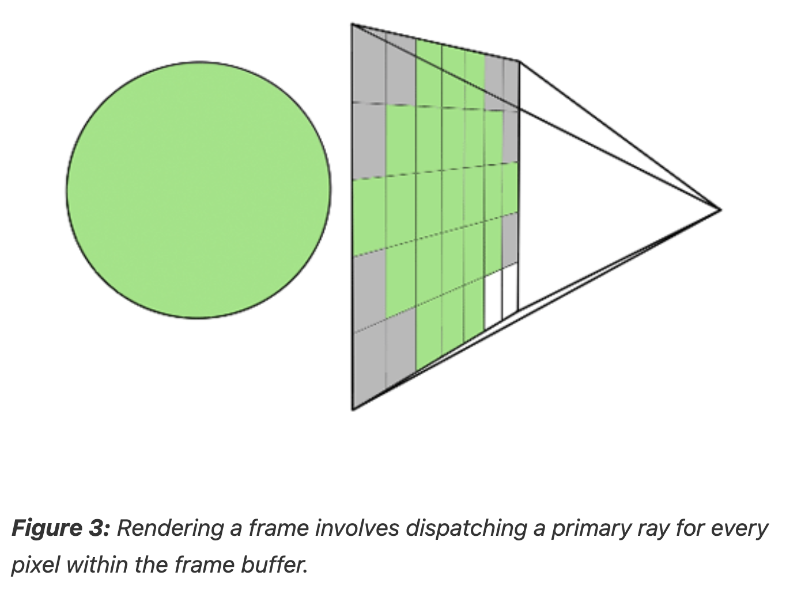

# Implementing the Raytracing Algorithm

The essence of the ray-tracing algorithm is to render an image pixel by pixel.

- For each pixel, it launches a primary ray into the scene, its direction determined by drawing a line from the eye through the pixel's center.

- This primary ray's journey is then tracked to ascertain if it intersects with any scene objects.

- In scenarios where multiple intersections occur, the algorithm selects the intersection nearest to the eye for further processing.

- A secondary ray, known as a shadow ray, is then projected from this nearest intersection point towards the light source (Figure 1).



An intersection point is deemed illuminated if the shadow ray reaches the light source unobstructed. Conversely, if it intersects another object en route, it signifies the casting of a shadow on the initial point (Figure 2).



Repeating this procedure across all pixels yields a two-dimensional depiction of our three-dimensional scene (Figure 3).



## Pseudocode

```
for (int j = 0; j < imageHeight; ++j) {
    for (int i = 0; i < imageWidth; ++i) {
        // Determine the direction of the primary ray
        Ray primRay;
        computePrimRay(i, j, &primRay);
        // Initiate a search for intersections within the scene
        Point pHit;
        Normal nHit;
        float minDist = INFINITY;
        Object *object = NULL;
        for (int k = 0; k < objects.size(); ++k) {
            if (Intersect(objects[k], primRay, &pHit, &nHit)) {
                float distance = Distance(eyePosition, pHit);
                if (distance < minDist) {
                    object = &objects[k];
                    minDist = distance;  // Update the minimum distance
                }
            }
        }
        if (object != NULL) {
            // Illuminate the intersection point
            Ray shadowRay;
            shadowRay.direction = lightPosition - pHit;
            bool isInShadow = false;
            for (int k = 0; k < objects.size(); ++k) {
                if (Intersect(objects[k], shadowRay)) {
                    isInShadow = true;
                    break;
                }
            }
        }
        if (!isInShadow)
            pixels[i][j] = object->color * light.brightness;
        else
            pixels[i][j] = 0;
    }
}
```

This simplicity contrasts sharply with more complex algorithms, like scanline rendering, making ray tracing comparatively effortless to implement.

The primary hindrance, both historically and to some extent currently, is its computational speed.

Thus, the crux of the issue with ray tracing is its slowness.

However, with the continual advancement of computing power, this limitation is becoming increasingly mitigated.

- Although ray tracing remains slower compared to methods like z-buffer algorithms, modern computers can now render frames in minutes that previously took hours.
