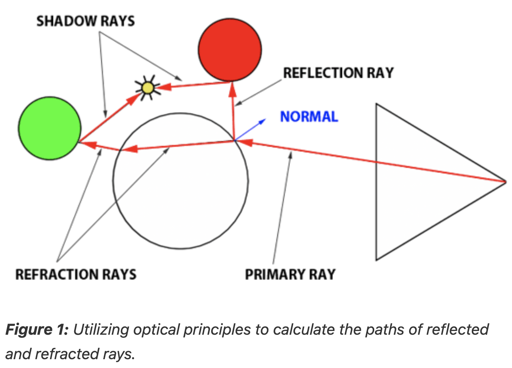
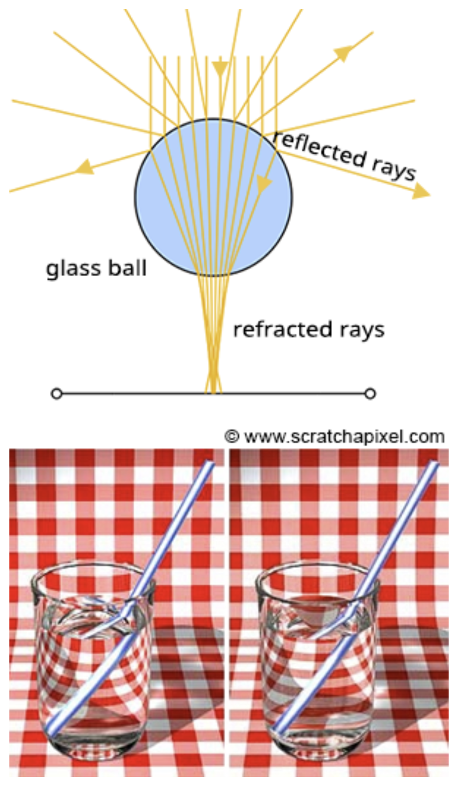

# Adding Reflection and Refraction

These capabilities are crucial for accurately rendering materials like glass or mirrored surfaces.

Whitted's innovation involved extending the algorithm to account for the computations necessary for handling reflection and refraction effects.

The directions for both reflected and refracted rays are determined by the surface normal at the point of contact and the incident ray's approach.

- Additionally, calculating the direction of refraction requires knowledge of the material's index of refraction.

- Refraction can be visualized as the bending of the ray's path when it transitions between mediums of differing refractive indices.

## Glass

It's also important to recognize that materials like a glass sphere possess both reflective and refractive properties simultaneously.

- The challenge arises in determining how to blend these effects at a specific surface point.

- Is it as simple as combining 50% reflection with 50% refraction? The reality is more complex.

- The blend ratio is influenced by the angle of incidence and factors like the surface normal and the material's refractive index.

- Here, the **Fresnel equation** plays a critical role, providing the formula needed to ascertain the appropriate mix of reflection and refraction.

In summary, the Whitted algorithm operates as follows: a primary ray is cast from the observer to identify the nearest intersection with any scene objects.

- Upon encountering a non-diffuse or transparent object, additional calculations are required.

- For an object such as a glass sphere, determining the surface color involves calculating both the reflected and refracted colors and then appropriately blending them according to the Fresnel equation.

- This three-step process -- calculating reflection, calculating refraction, and applying the Fresnel equation -- enables the realistic rendering of complex optical phenomena.

- For more details, look at this page: https://www.scratchapixel.com/lessons/3d-basic-rendering/introduction-to-ray-tracing/adding-reflection-and-refraction.html
